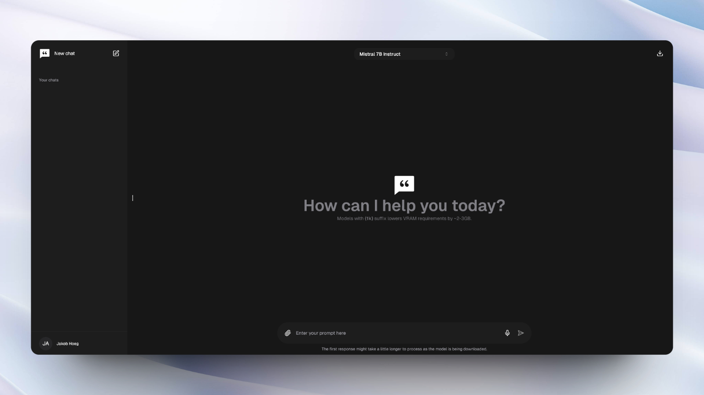

<div align="center">
  
  [](https://chattyui.com/)
  
</div>

<h1 align="center">
  Chatty
</h1>

<div align="center">
  
   

</div>

**Chatty** is your private AI that leverages WebGPU to run large language models (LLMs) natively & privately in your browser, bringing you the most feature rich in-browser AI experience.

# Features ✨

- **In-browser privacy:** All AI models run locally (client side) on your hardware, ensuring that your data is processed only on your pc. No server-side processing!
- **Offline:** Once the initial download of a model is processed, you'll be able to use it without an active internet connection.
- **Chat history:** Access and manage your conversation history.
- **Supports new open-source models:** Chat with popular open-source models such as Gemma, Llama2 & 3 and Mistral!
- **Responsive design:** If your phone supports WebGl, you'll be able to use Chatty just as you would on desktop.
- **Intuitive UI:** Inspired by popular AI interfaces such as Gemini and ChatGPT to enhance similarity in the user experience.
- **Markdown & code highlight:** Messages returned as markdown will be displayed as such & messages that include code, will be highlighted for easy access.
- **Chat with files:** Load files (pdf & all non-binary files supported - even code files) and ask the models questions about them - fully local! Your documents never gets processed outside of your local environment, thanks to [XenovaTransformerEmbeddings](https://huggingface.co/Xenova/all-MiniLM-L6-v2) & [MemoryVectorStore](https://js.langchain.com/v0.1/docs/integrations/vectorstores/memory/)
- **Custom memory support:** Add custom instructions/memory to allow the AI to provide better and more personalized responses.
- **Export chat messages:** Seamlessly generate and save your chat messages in either json or markdown format.
- **Voice input support:** Use voice interactions to interact with the models.
- **Regenerate responses:** Not quite the response you were hoping for? Quickly regenerate it without having to write out your prompt again.
- **Light & Dark mode:** Switch between light & dark mode.

# Preview

https://github.com/addyosmani/chatty/assets/114422072/a994cc5c-a99d-4fd2-9eab-c2d4267fcfd3

# Why?

This project is meant to be the closest attempt at bringing the familarity & functionality from popular AI interfaces such as ChatGPT and Gemini into a in-browser experience.

# Browser support

By default, WebGPU is enabled and supported in both Chrome and Edge. However, it is possible to enable it in Firefox and Firefox Nightly.
Check the [browser compatibility](https://developer.mozilla.org/en-US/docs/Web/API/WebGPU_API#browser_compatibility) for more information.

# How to Install

> If you just want to try out the app, it's live on [this](https://chattyui.com) website.
>
> This is a Next.js application and requires Node.js (18+) and npm installed to run the project locally.

## Install from source

If you want to setup and run the project locally, follow the steps below:

**1. Clone the repository to a directory on your pc via command prompt:**

```
git clone https://github.com/addyosmani/chatty
```

**2. Open the folder:**

```
cd chatty
```

**3. Install dependencies:**

```
npm install
```

**4. Start the development server:**

```
npm run dev
```

**5. Go to [localhost:3000](http://localhost:3000) and start chatting!**

## Docker

> [!NOTE]  
> The Dockerfile has not yet been optimized for a production environment. If you wish to do so yourself, checkout the [Nextjs example](https://github.com/vercel/next.js/blob/canary/examples/with-docker/Dockerfile)

```
docker build -t chattyui .
docker run -d -p 3000:3000 chattyui
```

Or use `docker-compose`:

```
docker compose up
```

> If you've made changes and want to rebuild, you can simply run `docker-compose up --build`

# Roadmap

- [ ] **Multiple file embeddings:** The ability to embed multiple files instead of one at a time for each session.
- [ ] **Prompt management system:** Select from and add different system prompts to quickly use in a session.

# Contributing

Contributions are more than welcome! However, please make sure to read the [contributing guidelines](https://github.com/addyosmani/chatty/blob/main/CONTRIBUTING.md) first :)

# Hardware requirements

> [!NOTE]  
> To run the models efficiently, you'll need a GPU with enough memory. 7B models require a GPU with about 6GB memory whilst 3B models require around 3GB.
>
> Smaller models might not be able to process file embeddings as efficient as larger ones.

# Acknowledgements & credits

Chatty is built using the [WebLLM](https://github.com/mlc-ai/web-llm) project, utilizing [HuggingFace](https://huggingface.co/), open source LLMs and [LangChain](https://www.langchain.com/). We want to acknowledge their great work and thank the open source community.

# Authors

Chatty is created and maintained by [Addy Osmani](https://github.com/addyosmani/) & [Jakob Hoeg Mørk](https://github.com/jakobhoeg).
